# HW4 Kubernetis #

----------

1) Разверните kubernetes  

Развернул в cloud.google.com. 

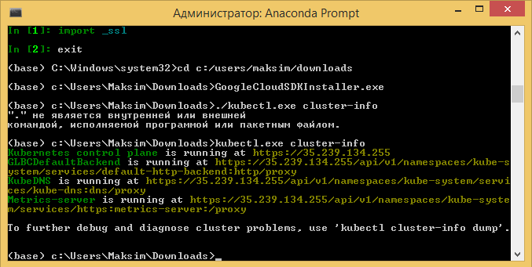
**(+5 баллов)**

2) Напишите простой pod manifests для вашего приложения, назовите его online-inference-pod.yaml
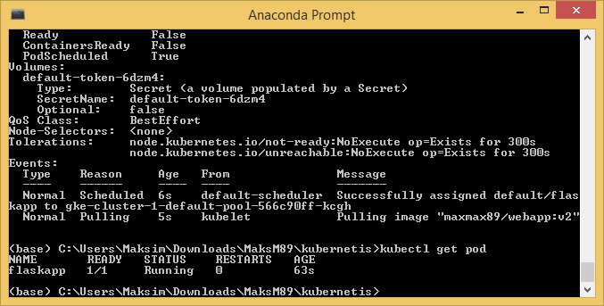  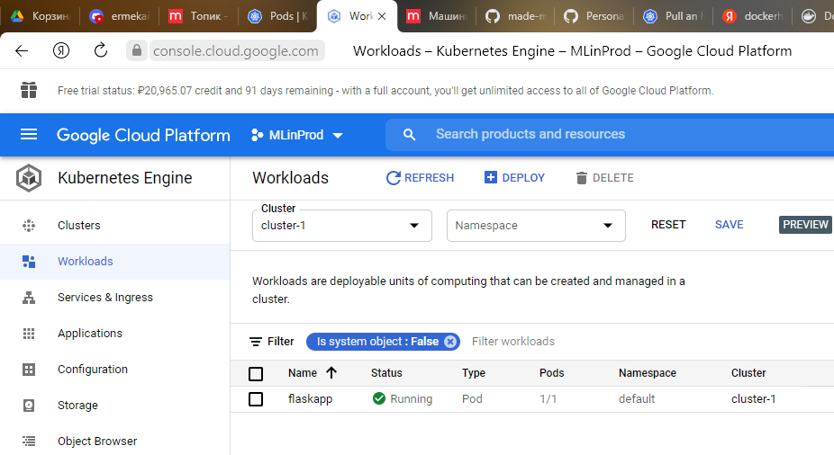 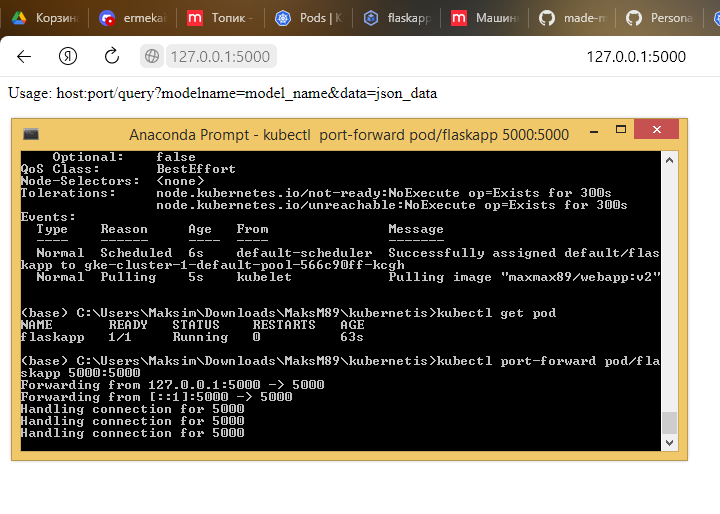
**(+4 балла)**

2а) Пропишите requests/limits и напишите зачем это нужно в описание PR
закоммитьте файл online-inference-pod-resources.yaml

requests - минимально необходимые ресурсы. Приложение не запустится на ноде, где их не будет хватать.
limits - максимально потребляемые ресурсы. При превышении будет перезапущено приложение.

**(+2 балла)**

3) Модифицируйте свое приложение так, чтобы оно стартовало не сразу(с задержкой секунд 20-30) и падало спустя минуты работы. 
Добавьте liveness и readiness пробы , посмотрите что будет происходить.
Напишите в описании -- чего вы этим добились.

Код приложения не стал менять. Изменил команду докер-контейнера (*command* и *args* в *online-inference-pod-probes.yaml*).

В результате после поднятия пода "сон" 10 секунд, затем запускается приложение из контейнера, через 10 секунд убивается и дальше "сон" 10 минут. При этом:

- **startupProbe**  проверяет, запущено ли приложение путём TCP запроса на `<ip>:<port>/`. Если приложение не запустится через 25 секунд, перезагружает контейнер (для проверки нужно первый *sleep* сделать 30с). 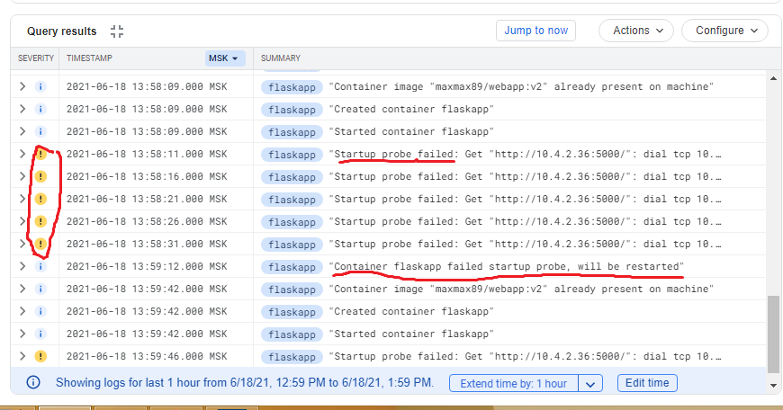
- **livenessProbe** раз в 10 секунд проверяет, работает ли приложение. После 1 неудачной попытки перезапускает контейнер
- **readinessProbe** раз в 5 секунд проверяет работоспособность приложения. Если не отвечает, не посылает трафик на этот pod.
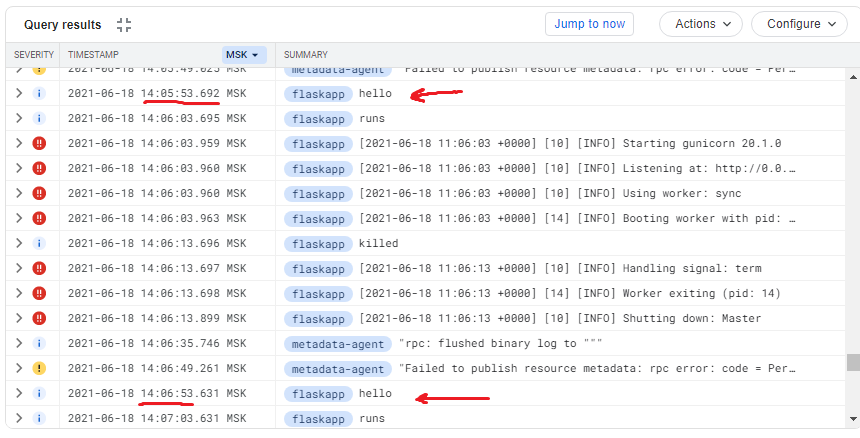 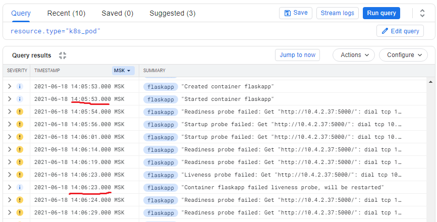

**(+3 балла)**

4) Создайте replicaset, сделайте 3 реплики вашего приложения. (https://kubernetes.io/docs/concepts/workloads/controllers/replicaset/)
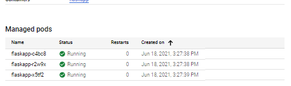

Ответьте на вопрос, что будет, если сменить докер образа в манифесте и одновременно с этим 
а) уменьшить число реплик - останутся только старые версии приложения
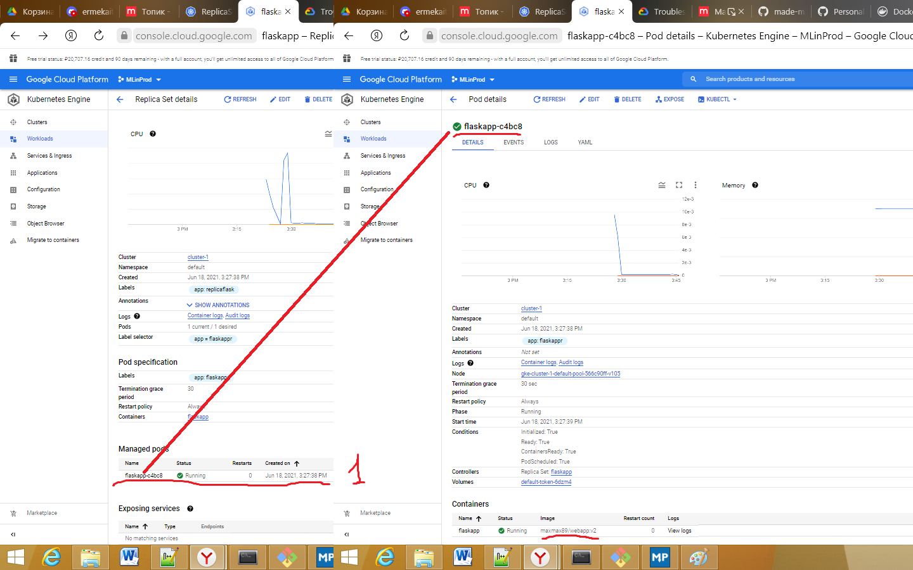
б) увеличить число реплик - появятся новые версии приложения, но будут и старые
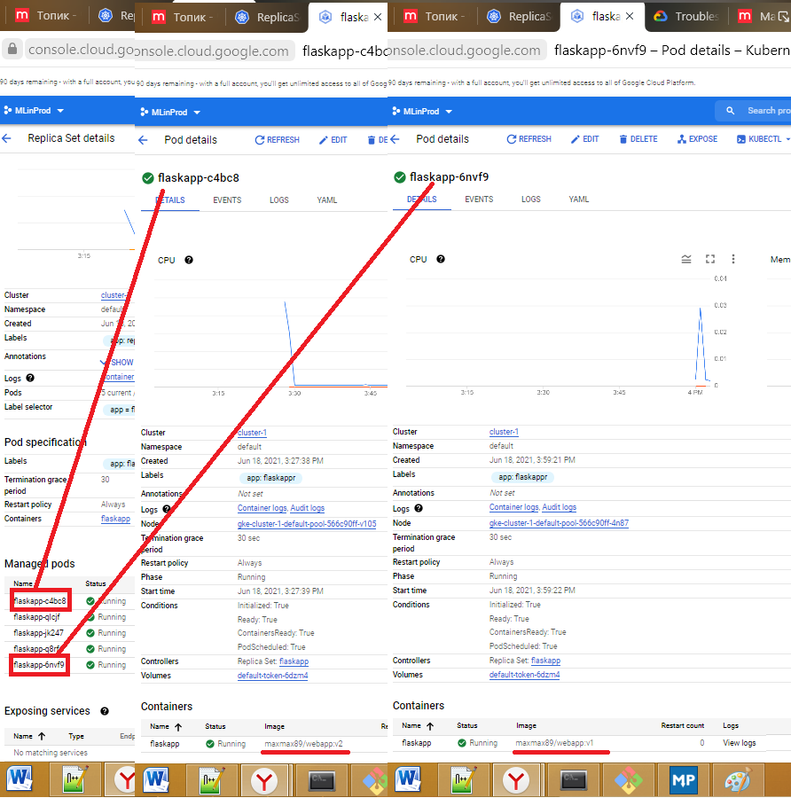

**(+3 балла)**

5) Опишите деплоймент для вашего приложения. Играя с параметрами деплоя(maxSurge, maxUnavaliable), добейтесь ситуации, когда при деплое новой версии 
a) Есть момент времени, когда на кластере есть как все старые поды, так и все новые.
При установке *maxUnavailable: 0* запускаются новые версии, но пока они не пройдут readnessProbe, старые не уйдут. Какое-то время будут и старые, и новые.
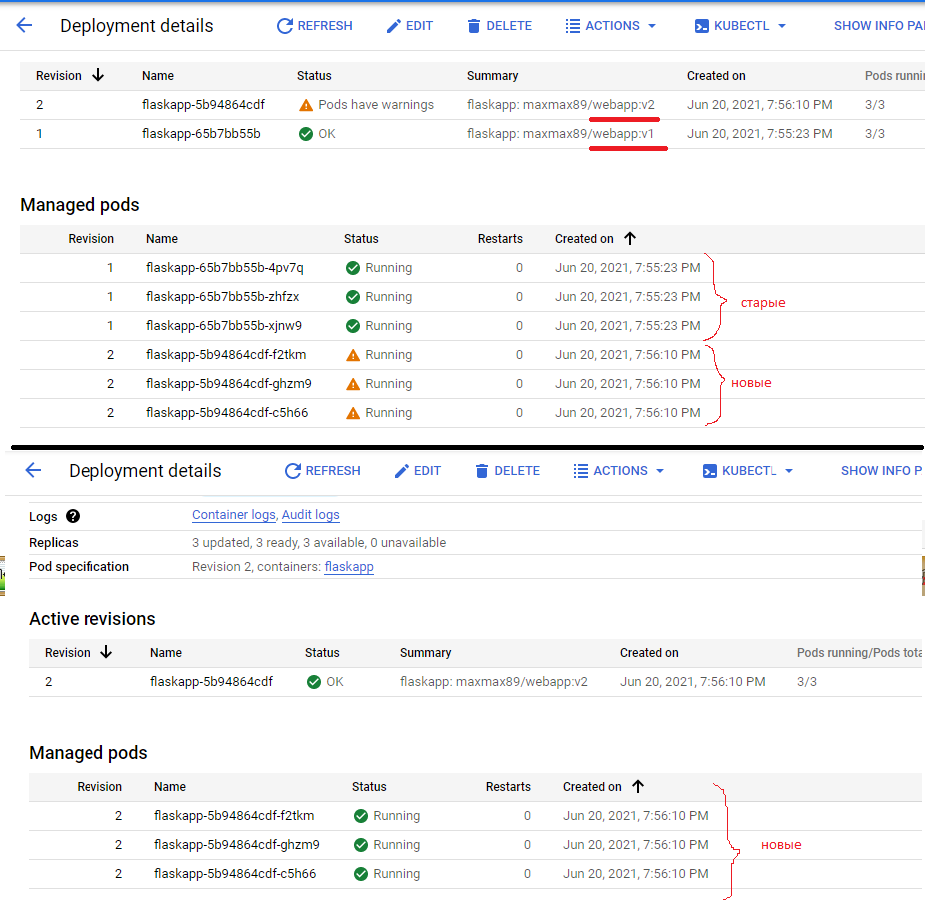
б) одновременно с поднятием новых версий, гасятся старые.
  Сделаем *maxUnavailable* > 0, тогда будут гаситься старые, запускаться новые. При этом новые могут быть недоступны какое-то время.
**(+3 балла)**